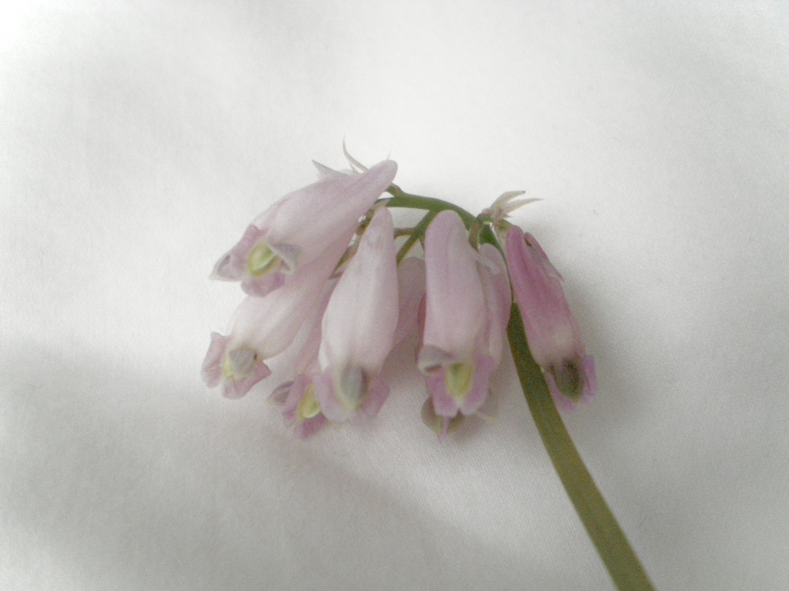

 I went birding and picked pretty flowers yesterday.

 Saw an eagle loom over the lake and listened to many different calls.  
 The weather was pretty. Everything was dewy from the rain just a few hours before. I wore my cat shoes and polka-dot raincoat and stomped along the trail. My pants were muddied around the ankles. Still haven't washed them.

 A lot of elder birders had been walking the same trail... they saw my binoculars and immediately started speaking to me.

 

  ?: Seeing anything cool?  
  Me: Immature eagle and sinister turkey vulture  
  ?: Are you using the app "Merlin"?  
  Me: Yes  
  ?: Lit (no one said this)

‎  
I was not feeling social. I have been very sad. But it was cute to see people so eager to chat about birds. I don't know much about them, but they knew a lot.

The flowers I picked are currently smashed between my German and Ecology textbooks.  
Yaaaaaaaaaaaaaay (◡__◡✿)｡ ₊ ⊹° ꕤ