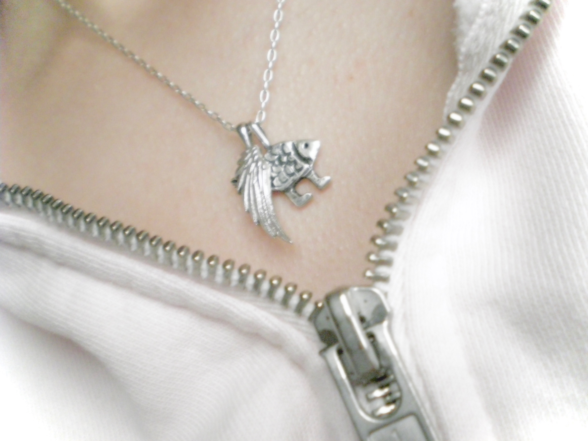
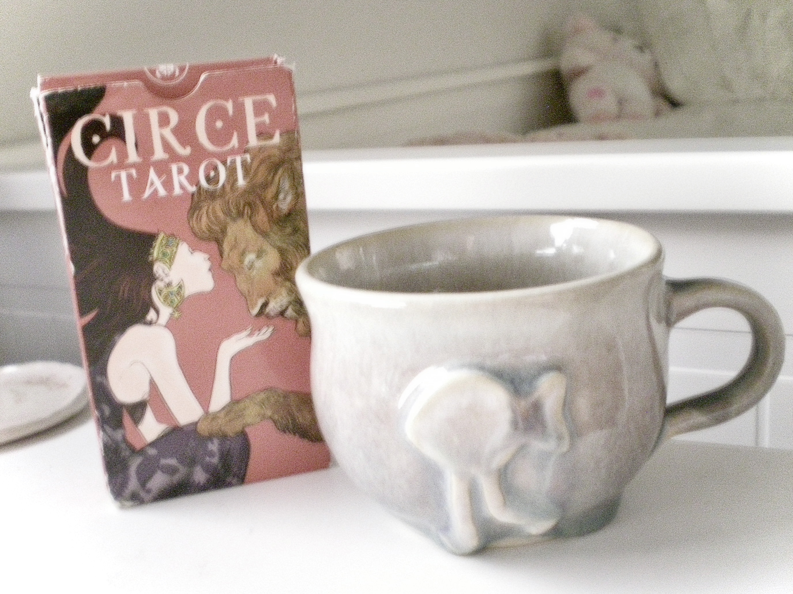
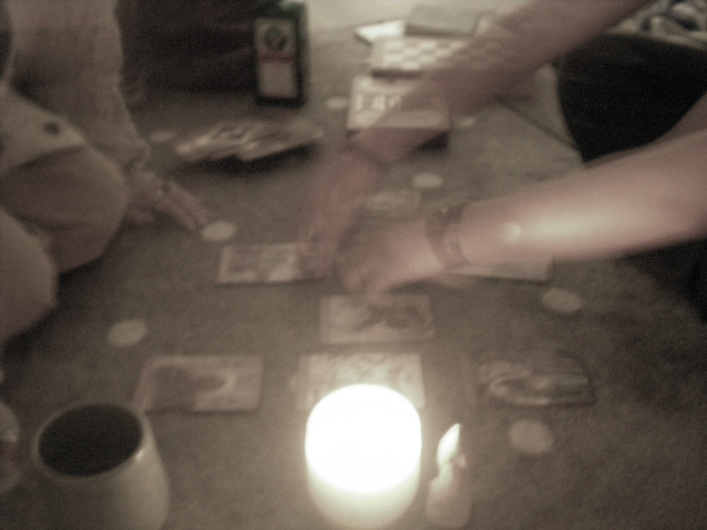

My two friends are transferring schools next year, so I will be a loner again.

Today, they both ambushed me with love in the form of gifts:  
*A retired tarot deck, and a teacup inspired by my necklace.*

I received short lectures from each friend before the gifts... one of them saying that, even though I've been unwell, perhaps the cards might help clear my mind... and the other, that the teacup will remind me of our happy times together.

  I feel like I am about to be put down like an old dog.

A few weeks ago, I planned a *serious* birthday party for Tarot Card Friend.  
It was my master plan. I baked a cake from scratch, forced all of her friends to agree on a time for dinner, and made the reservation. It was a great success. I was so glad that my military-style preparation ammounted to the "perfect day" for her...

After dinner, she and Teacup Friend came to my place and sat on the floor for hours, talking, laughing, and listening to music. I had an hour-long presentation the next morning, but any concern I may have felt regarding it did not activate until after my guests left... *at around 4 in the morning.*

But I wouldn't have changed anything. It was truly one of my happiest nights. 

It'll be beautiful to watch them chase their dreams, but it would be naive to say that I'm not sad. I don't think we will all be together like this again.  
Really bittersweet. 